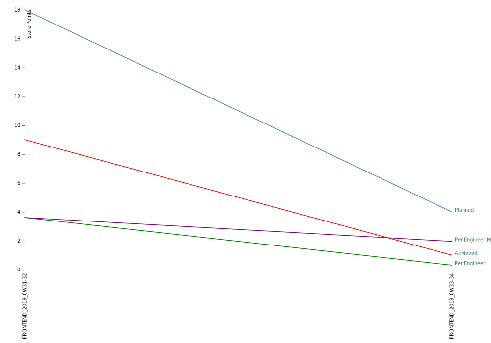

# Velocity Tracking

## Chart

## Data

|Sprint|Engineers|Planned|Achieved|Achieved/Engineer|Achieved/Engineer(MA 3 Weeks)|
|:-|-:|-:|-:|-:|-:|
[FRONTEND_2018_CW31-32](https://github.com/jwalendowsky/algorithms/milestone/2)|2.5|18|9|3.60|3.60|
[FRONTEND_2018_CW33-34](https://github.com/jwalendowsky/algorithms/milestone/1)|3.3|4|1|0.30|1.95|
